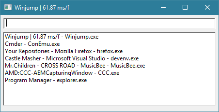

# Winjump

Winjump is a utility that allows moving between windows on the desktop quicker. I.e. programming in Vim and need to go to some other window without move hands from the home keys.

Currently this project is mostly to play around and learn different things so the implementation is rough and crude. At the moment it is running using GLFW and ImGUI to get it up quickly, as a result it has a high memory footprint. It is statically linked to GLFW and the C-Runtime library so there should not be too many dependencies other than the default Windows libraries.

# Usage
1. Press ALT-K (non-configurable at the moment) to activate the Window.
2. Type in desired window name to bring to front.
3. Press enter when name matches the window name.

# Build
Project is developed under Visual Studio 2015, but probably works with other version. You can either build using the IDE, but there's also provided a build.bat file using Visual Studio build tools. Only 32 bit has been configured, the 64bit components are there, just not configured into the build steps yet.

All files are included with repository, so should be able to build as is.

### Build Dependencies
* [GLFW - Multiplatform OpenGL/Window Library](http://www.glfw.org/)
* [ImGui - Immediate Mode Graphical User interface](https://github.com/ocornut/imgui)
* [GL3W - Simple OpenGL core profile loading](https://github.com/skaslev/gl3w)
