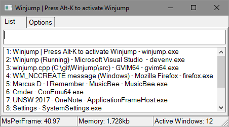
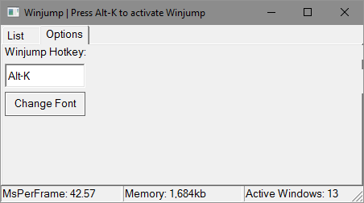

# Winjump

Winjump is a small Windows utility built using the WIN32 api, for quickly navigating between applications when programming. Winjump is designed to accomodate the ideology of working with home row keys, minimising the travel time between writing code and searching information. The application allows you to bring other active applications to focus by searching its' name.

The project is currently built using the WIN32API with minimal external libraries. As a result it's a single file executable with little to no dependencies and has a light footprint.

The program searches and attemps to match by
- Window Title
- Index in list
- Executable name

# Usage
1. Press ALT-K (configurable hotkey) to activate the Window.
2. Type in desired window name to bring to front.
3. Press enter when name matches the window name.

# Build
Project is developed under Visual Studio 2017. You can build using the provided solution. There's also a build.bat file using Visual Studio build tools for command line compilation.
